# ComfyUI-Specter

[](https://opensource.org/licenses/MIT)
[](https://github.com/comfyanonymous/ComfyUI)
[](https://www.python.org/)

**Use ChatGPT, Grok, and Gemini in ComfyUI.** No API keys, no extra costs. Just your existing accounts (even free tiers work).

*Specter is a stealthy browser phantom that automates web interfaces in the background. Headless and invisible.*

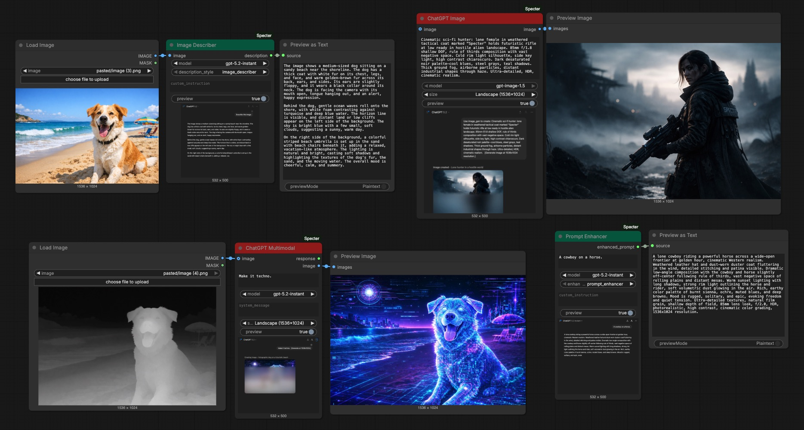

https://github.com/user-attachments/assets/ffbe5846-24ae-4c7c-a393-4b504e196287

## How It Works

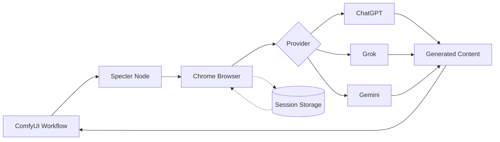

## Why Specter?

Already paying for ChatGPT Plus/Pro, X Premium, or Google AI Pro/Ultra? Use those features in ComfyUI without extra API costs.

| | API | Your Existing Subscription |
|---|---|---|
| **ChatGPT Image** | ~$0.05/image | Included |
| **GPT-5.2** | $0.88-7/1M tokens | Included |
| **Grok Image** | $0.01/image | Included |
| **Grok Video** | No API | Included |
| **Gemini** | $0.075-0.30/1M tokens | Included |

## Installation

### Windows

1. Clone to your ComfyUI `custom_nodes` folder:
   ```cmd
   cd ComfyUI\custom_nodes
   git clone https://github.com/lars-hagen/ComfyUI-Specter.git
   ```

2. Install dependencies:
   ```cmd
   cd ComfyUI-Specter
   pip install -r requirements.txt
   patchright install chrome
   ```

3. Restart ComfyUI

### macOS / Linux

1. Clone to your ComfyUI `custom_nodes` folder:
   ```bash
   cd ComfyUI/custom_nodes
   git clone https://github.com/lars-hagen/ComfyUI-Specter.git
   ```

2. Install dependencies:
   ```bash
   cd ComfyUI-Specter
   pip install -r requirements.txt
   patchright install chrome
   ```

3. Restart ComfyUI

### Authentication

After installation, authenticate with your accounts:

**Option 1: Embedded Browser (Recommended)**
- **Automatic:** Run any Specter node - a login popup appears if needed
- **Manual:** Go to Settings > Specter > Authentication > Sign In

https://github.com/user-attachments/assets/81329d1c-42d0-48c0-9137-a19ed5b8ba41

**Option 2: Cookie Import**

If the embedded browser doesn't work (VPN, network restrictions, etc.), import cookies from your regular browser:

1. Install [Get cookies.txt LOCALLY](https://chromewebstore.google.com/detail/get-cookiestxt-locally/cclelndahbckbenkjhflpdbgdldlbecc) (Chrome/Edge) or [Firefox version](https://addons.mozilla.org/en-US/firefox/addon/get-cookies-txt-locally/)
2. Go to [chatgpt.com](https://chatgpt.com), [grok.com](https://grok.com), or [gemini.google.com](https://gemini.google.com) and log in
3. Click the extension icon and export cookies (JSON or Netscape TXT format)
4. In ComfyUI: Settings > Specter > Authentication > click the import button (📥) > paste or drop the file

Sessions save automatically for future use.

## Nodes

### ChatGPT

| Node | Description |
|------|-------------|
| **ChatGPT Text** | Text chat with GPT models |
| **ChatGPT Image** | Image generation with gpt-image-1.5 |
| **ChatGPT Prompt Enhancer** | Enhance prompts for better image results |
| **ChatGPT Image Describer** | Generate descriptions from images |

### Grok

| Node | Description |
|------|-------------|
| **Grok Text** | Text chat with Grok models |
| **Grok Image** | Text-to-image generation |
| **Grok Image Edit** | Image-to-image editing |
| **Grok Text to Video** | Text-to-video generation |
| **Grok Image to Video** | Image-to-video generation |
| **Grok Video Combine** | Combine videos sequentially |
| **Grok Prompt Enhancer** | Enhance prompts for better results |
| **Grok Image Describer** | Generate descriptions from images |

### Gemini

| Node | Description |
|------|-------------|
| **Gemini Text** | Multimodal chat with Gemini models |
| **Nano Banana** | Image generation with Gemini 1.5 Flash |
| **Nano Banana Pro** | Image generation with Gemini 3.0 models |
| **Gemini Prompt Enhancer** | Enhance prompts for better results |
| **Gemini Image Describer** | Generate descriptions from images |

## Example Workflows

### ChatGPT Text to Image
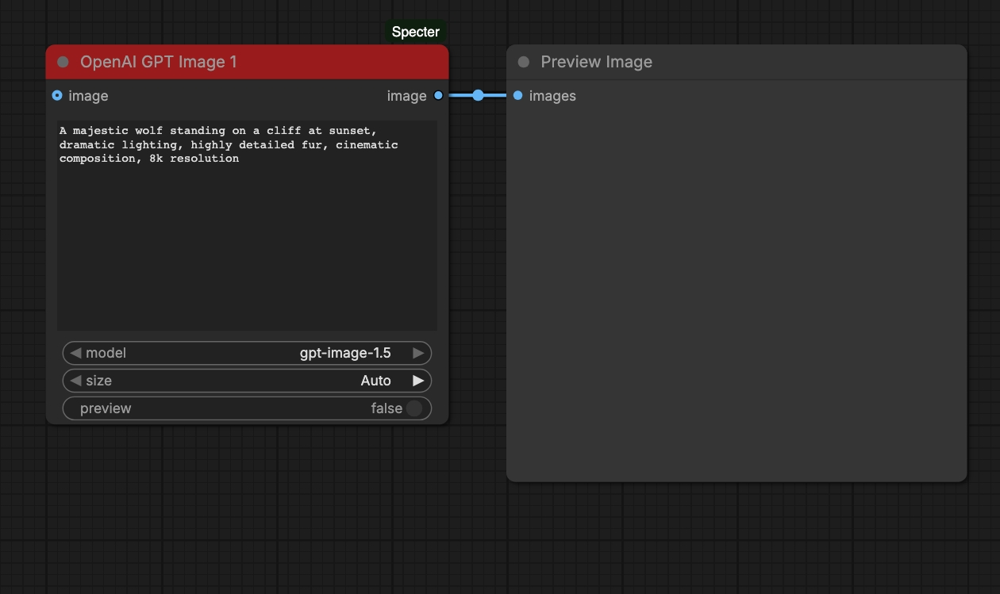

[Download workflow](example_workflows/chatgpt_txt2img.json)

### ChatGPT Image to Image


[Download workflow](example_workflows/chatgpt_img2img.json)

### ChatGPT Prompt Enhancer
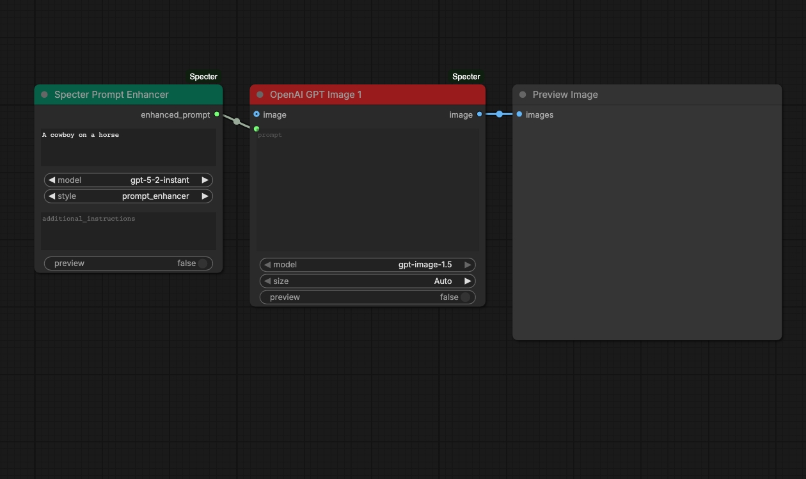

[Download workflow](example_workflows/chatgpt_prompt_enhancer.json)

### ChatGPT Image Describer
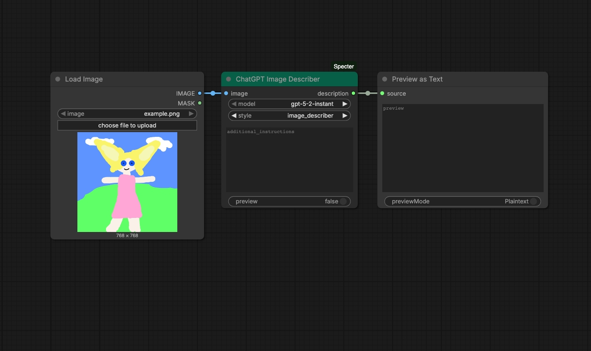

[Download workflow](example_workflows/chatgpt_image_describer.json)

### Grok Text to Image
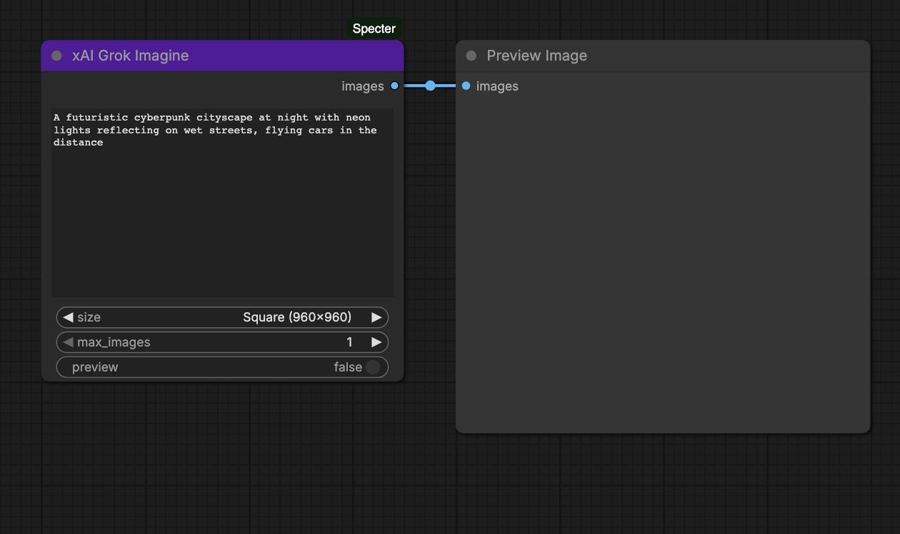

[Download workflow](example_workflows/grok_txt2img.json)

### Grok Text to Video
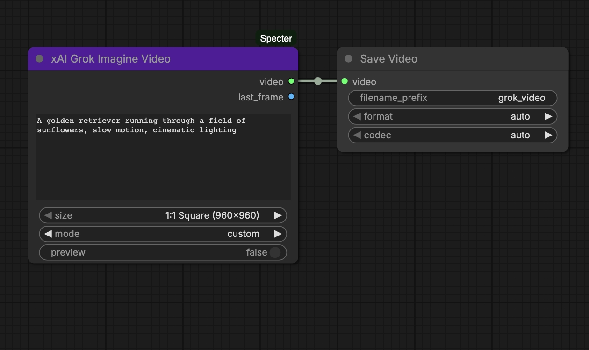

[Download workflow](example_workflows/grok_txt2vid.json)

### Grok Image to Video
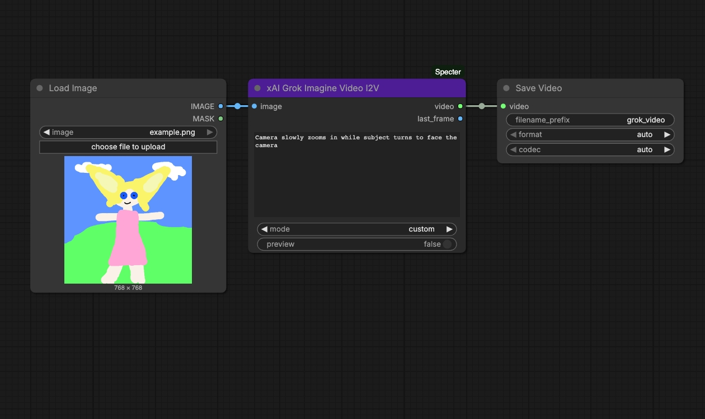

[Download workflow](example_workflows/grok_img2vid.json)

### Grok Chat
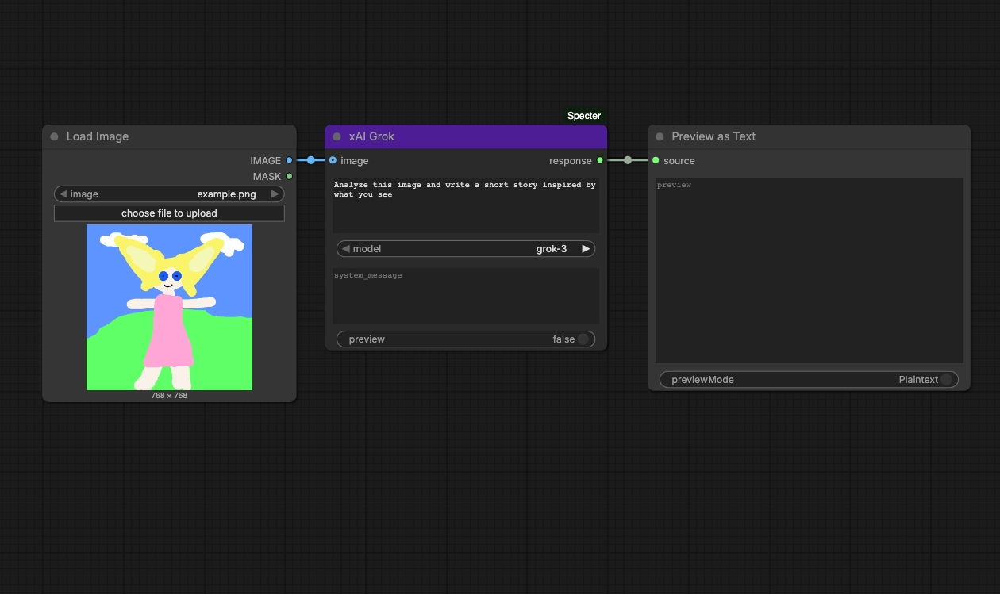

[Download workflow](example_workflows/grok_chat.json)

### Gemini Text to Image
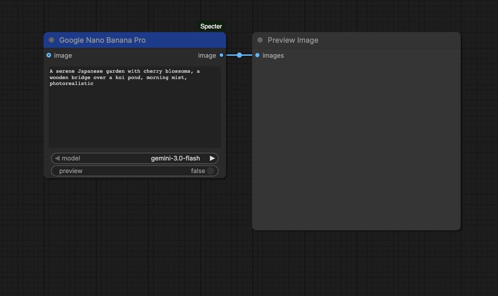

[Download workflow](example_workflows/gemini_txt2img.json)

### Gemini Chat
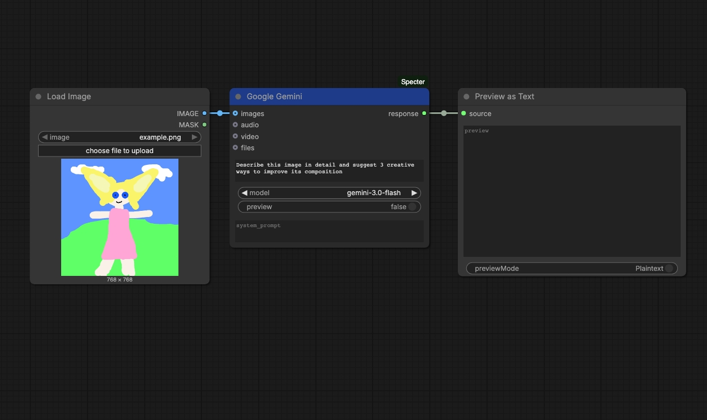

[Download workflow](example_workflows/gemini_chat.json)

## Rate Limits

| | Free | Paid | Top Tier |
|---|---|---|---|
| **ChatGPT Image** | ~3/day | ~50/3hr (Plus) | Unlimited (Pro) |
| **ChatGPT Text** | Limited | ~80/3hr (Plus) | Unlimited (Pro) |
| **Grok Image** | ~20/day | 100/day (Premium) | 200/day (SuperGrok) |
| **Grok Video** | ~20/day | 100/day (Premium) | 200/day (SuperGrok) |
| **Gemini** | 50/day | Higher (AI Pro) | Highest (AI Ultra) |

## Troubleshooting

- **"Missing system dependencies"** - Run `patchright install chrome` to install the browser
- **Session expired?** Go to Settings > Specter > Authentication and click Sign In
- **Browser not closing?** Check for zombie Chrome processes
- **Login loop?** Delete session via Settings > Specter or remove `user_data/` folder
