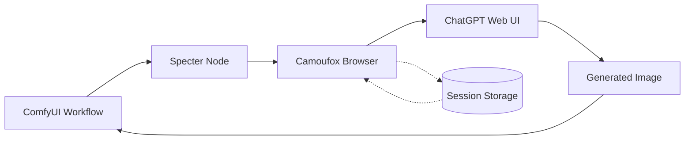

# ComfyUI-Specter

Browser automation nodes for AI web interfaces. Access ChatGPT models through the web UI instead of expensive API calls.

https://github.com/user-attachments/assets/265ad87a-1fc4-426e-8c88-d7e2505cc544


## How It Works



## Why Specter?

| | API | Specter (Web UI) |
|---|---|---|
| **Image Generation** | $0.19/image | **FREE** (with any tier) |
| **GPT-5.2** | $2.50/1M tokens | **Included in subscription** |
| **o3 Reasoning** | $10-20/1M tokens | **Included in Plus/Pro** |

## Image Capabilities (gpt-image-1.5)

**Generation**
- Text-to-Image                                                       
- Image editing (img2img)  
- Text rendering in images (posters, infographics)

**Editing**
- Inpainting
- Object add/remove
- Background replacement
- Style transfer
- Clothing/appearance changes

**Preservation**
- Facial likeness consistency
- Lighting/composition matching
- Color tone preservation

## Model Access by Subscription

| Model | Free | Go ($5) | Plus ($20) | Pro ($200) |
|-------|------|---------|------------|------------|
| **gpt-image-1.5** | 2-3/day | Extended | 50/3hr | Unlimited |
| **gpt-5.2** | 10/5hr | 10-30/day | 160/3hr | Unlimited |
| **gpt-5.2-instant** | Fallback | Default | Full | Unlimited |
| **gpt-5.2-thinking** | 1/day | Auto | Full | Unlimited |
| **o3** | - | - | 100/week | Unlimited |
| **o4-mini** | - | - | 300/day | Unlimited |
| **gpt-4o** | Limited | - | 80/3hr | Unlimited |

## Installation

1. Clone to your ComfyUI `custom_nodes` folder:
   ```bash
   cd ComfyUI/custom_nodes
   git clone https://github.com/lars-hagen/ComfyUI-Specter.git
   ```

2. Install dependencies:
   ```bash
   cd ComfyUI-Specter
   pip install -r requirements.txt
   python3 -m camoufox fetch
   ```

3. Restart ComfyUI

## Nodes

| Node | Description |
|------|-------------|
| **Specter ChatGPT** | Send prompts to ChatGPT, get text + generated images |

## Usage

1. Add **Specter ChatGPT** node to workflow
2. First run opens browser - log in to ChatGPT
3. Session saved automatically
4. Future runs are headless

Use `force_login` to re-authenticate if session expires.

## Example Workflows

| Workflow | Description |
|----------|-------------|
| [txt2img_basic](example_workflows/txt2img_basic.json) | Text-to-image generation |
| [img2img_edit](example_workflows/img2img_edit.json) | Edit/transform existing images |
| [prompt_enhancer](example_workflows/prompt_enhancer.json) | Enhance basic prompts with GPT |
| [image_describer](example_workflows/image_describer.json) | Generate descriptions from images |

## Troubleshooting

- **Session expired?** Enable `force_login` input
- **Browser not closing?** Check for zombie Firefox processes
- **Login loop?** Delete `chatgpt_session.json` and retry

## Coming Soon

- Gemini
