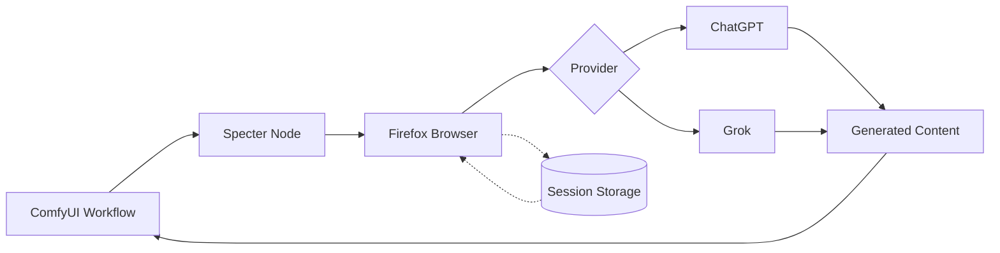

# ComfyUI-Specter

[](https://opensource.org/licenses/MIT)
[](https://github.com/comfyanonymous/ComfyUI)
[](https://www.python.org/)

**Use ChatGPT and Grok in ComfyUI.** No API keys, no extra costs. Just your existing accounts (even free tiers work).

*Specter is a stealthy browser phantom that automates web interfaces in the background. Headless and invisible.*


https://github.com/user-attachments/assets/ffbe5846-24ae-4c7c-a393-4b504e196287

## How It Works



## Why Specter?

Already paying for ChatGPT Plus/Pro or X Premium? Use those features in ComfyUI without extra API costs.

| | API | Your Existing Subscription |
|---|---|---|
| **ChatGPT Image** | ~$0.05/image | Included |
| **GPT-5.2** | $0.88-7/1M tokens | Included |
| **Grok Image** | $0.01/image | Included |
| **Grok Video** | No API | Included |

## Installation

### Windows

1. Clone to your ComfyUI `custom_nodes` folder:
   ```cmd
   cd ComfyUI\custom_nodes
   git clone https://github.com/lars-hagen/ComfyUI-Specter.git
   ```

2. Install dependencies:
   ```cmd
   cd ComfyUI-Specter
   pip install -r requirements.txt
   ```

3. Restart ComfyUI

### macOS / Linux

1. Clone to your ComfyUI `custom_nodes` folder:
   ```bash
   cd ComfyUI/custom_nodes
   git clone https://github.com/lars-hagen/ComfyUI-Specter.git
   ```

2. Install dependencies:
   ```bash
   cd ComfyUI-Specter
   pip install -r requirements.txt
   # Linux only: install browser system dependencies
   sudo playwright install-deps firefox
   ```

3. Restart ComfyUI

### Authentication

After installation, authenticate with your accounts:

**Option 1: Embedded Browser (Recommended)**
- **Automatic:** Run any Specter node - a login popup appears if needed
- **Manual:** Go to Settings > Specter > Authentication > Sign In

https://github.com/user-attachments/assets/81329d1c-42d0-48c0-9137-a19ed5b8ba41

**Option 2: Cookie Import**

If the embedded browser doesn't work (VPN, network restrictions, etc.), import cookies from your regular browser:

1. Install [Get cookies.txt LOCALLY](https://chromewebstore.google.com/detail/get-cookiestxt-locally/cclelndahbckbenkjhflpdbgdldlbecc) (Chrome/Edge) or [Firefox version](https://addons.mozilla.org/en-US/firefox/addon/get-cookies-txt-locally/)
2. Go to [chatgpt.com](https://chatgpt.com) or [grok.com](https://grok.com) and log in
3. Click the extension icon and export cookies (JSON or Netscape TXT format)
4. In ComfyUI: Settings > Specter > Authentication > click the import button (📥) > paste or drop the file

Sessions save automatically for future use.

## Nodes

### ChatGPT

| Node | Description |
|------|-------------|
| **ChatGPT Text** | Text chat with GPT models |
| **ChatGPT Image** | Image generation with gpt-image-1.5 |
| **ChatGPT Prompt Enhancer** | Enhance prompts for better image results |
| **ChatGPT Image Describer** | Generate descriptions from images |

### Grok

| Node | Description |
|------|-------------|
| **Grok Text** | Text chat with Grok models |
| **Grok Image** | Text-to-image generation |
| **Grok Image Edit** | Image-to-image editing |
| **Grok Text to Video** | Text-to-video generation |
| **Grok Image to Video** | Image-to-video generation |
| **Grok Video Combine** | Combine videos sequentially |
| **Grok Prompt Enhancer** | Enhance prompts for better results |
| **Grok Image Describer** | Generate descriptions from images |

## Example Workflows

### Text to Image
Generate images from text prompts using ChatGPT Image.


[Download workflow](example_workflows/txt2img_basic.json)

### Image to Image
Edit and transform images with ChatGPT Multimodal.


[Download workflow](example_workflows/img2img_edit.json)

### Prompt Enhancer
Enhance basic prompts for better image generation results.


[Download workflow](example_workflows/prompt_enhancer.json)

### Image Describer
Generate detailed descriptions from images.


[Download workflow](example_workflows/image_describer.json)

## Rate Limits

| | Free | Plus/Premium | Pro/SuperGrok |
|---|---|---|---|
| **ChatGPT Image** | ~3/day | ~50/3hr | Unlimited |
| **ChatGPT Text** | Limited | ~80/3hr | Unlimited |
| **Grok Image** | ~20/day | 100/day | 200/day |
| **Grok Video** | ~20/day | 100/day | 200/day |

## Troubleshooting

- **"Missing system dependencies"** - Run `sudo playwright install-deps` to install required libraries
- **Session expired?** Go to Settings > Specter > Authentication and click Sign In
- **Browser not closing?** Check for zombie Firefox processes
- **Login loop?** Delete session via Settings > Specter or remove `user_data/` folder

## Coming Soon

- Gemini support
