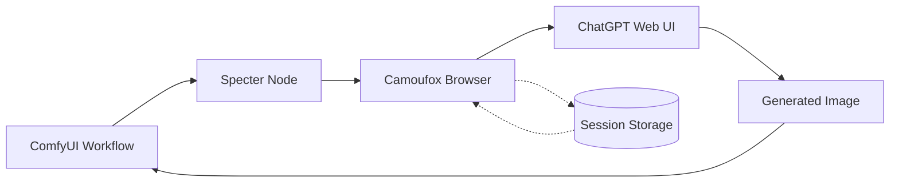
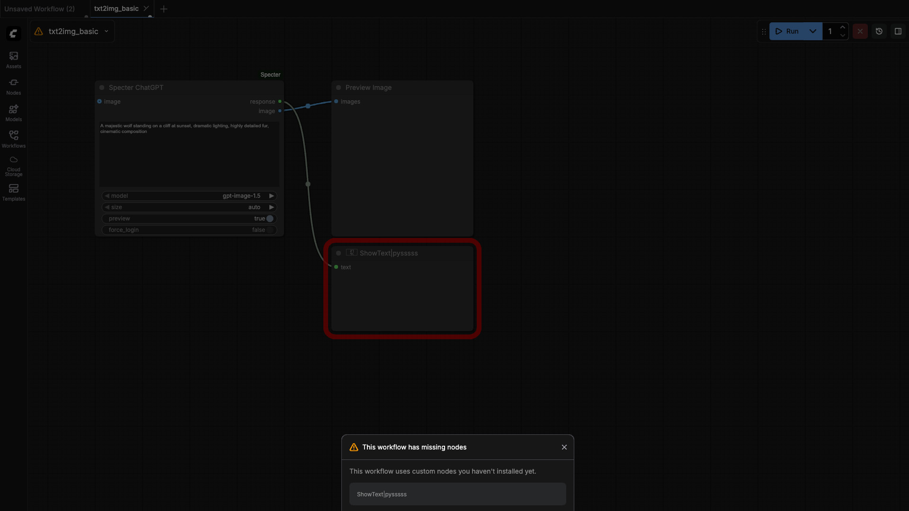
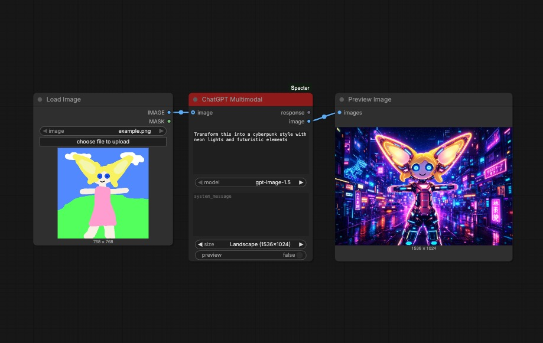
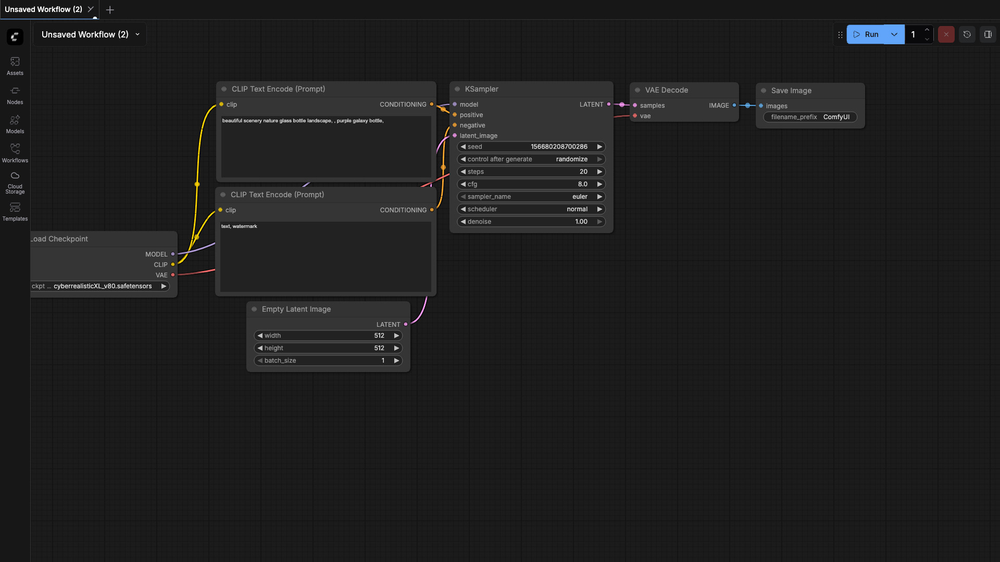

# ComfyUI-Specter

Browser automation nodes for AI web interfaces. Access ChatGPT models through the web UI instead of expensive API calls.


https://github.com/user-attachments/assets/013162f9-e833-4f44-b5ea-ea57a7a6b382

## How It Works



## Why Specter?

| | API | Specter (Web UI) |
|---|---|---|
| **Image Generation** | $0.19/image | **FREE** (with any tier) |
| **GPT-5.2** | $2.50/1M tokens | **Included in subscription** |
| **o3 Reasoning** | $10-20/1M tokens | **Included in Plus/Pro** |

## Installation

1. Clone to your ComfyUI `custom_nodes` folder:
   ```bash
   cd ComfyUI/custom_nodes
   git clone https://github.com/lars-hagen/ComfyUI-Specter.git
   ```

2. Install dependencies:
   ```bash
   cd ComfyUI-Specter
   pip install -r requirements.txt
   python3 -m camoufox fetch
   ```

3. Restart ComfyUI

4. **Authenticate with ChatGPT:**
   - Open ComfyUI Settings (gear icon)
   - Navigate to **Specter > Authentication**
   - Click **Sign In** and complete login in the popup
   - Session saves automatically for future use

## Nodes

| Node | Category | Description |
|------|----------|-------------|
| **ChatGPT Multimodal** | Specter | Full-featured node with text + image input/output |
| **ChatGPT Image** | Specter/Core | Optimized for image generation (uses gpt-image-1.5) |
| **ChatGPT Text** | Specter/Core | Text-only responses, faster for text tasks |
| **Prompt Enhancer** | Specter/Tools | Enhance basic prompts for better image results |
| **Image Describer** | Specter/Tools | Generate detailed descriptions from images |

## Example Workflows

### Text to Image
Generate images from text prompts using ChatGPT Image.



[Download workflow](example_workflows/txt2img_basic.json)

### Image to Image
Edit and transform images with ChatGPT Multimodal.



[Download workflow](example_workflows/img2img_edit.json)

### Prompt Enhancer
Enhance basic prompts for better image generation results.



[Download workflow](example_workflows/prompt_enhancer.json)

### Image Describer
Generate detailed descriptions from images.


[Download workflow](example_workflows/image_describer.json)

## Image Capabilities (gpt-image-1.5)

**Generation**
- Text-to-Image
- Image editing (img2img)
- Text rendering in images (posters, infographics)

**Editing**
- Inpainting
- Object add/remove
- Background replacement
- Style transfer
- Clothing/appearance changes

**Preservation**
- Facial likeness consistency
- Lighting/composition matching
- Color tone preservation

## Model Access by Subscription

| Model | Free | Plus ($20) | Pro ($200) |
|-------|------|------------|------------|
| **gpt-image-1.5** | 2-3/day | 50/3hr | Unlimited |
| **gpt-5.2** | 10/5hr | 160/3hr | Unlimited |
| **gpt-5.2-instant** | Fallback | Full | Unlimited |
| **o3** | - | 100/week | Unlimited |

## Troubleshooting

- **Session expired?** Go to Settings > Specter > Authentication and click Sign In
- **Browser not closing?** Check for zombie Firefox processes
- **Login loop?** Delete `chatgpt_session.json` and retry

## Coming Soon

- Gemini support
