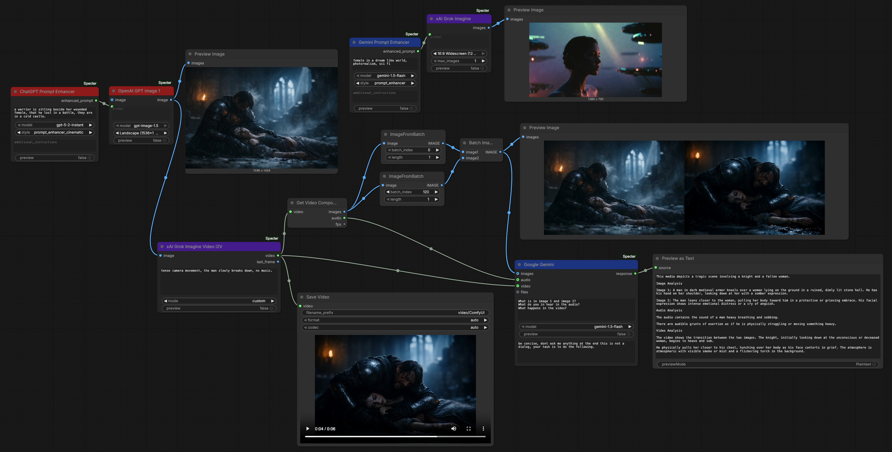
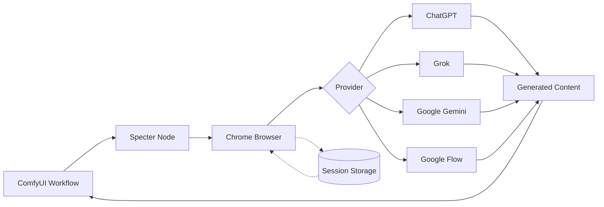
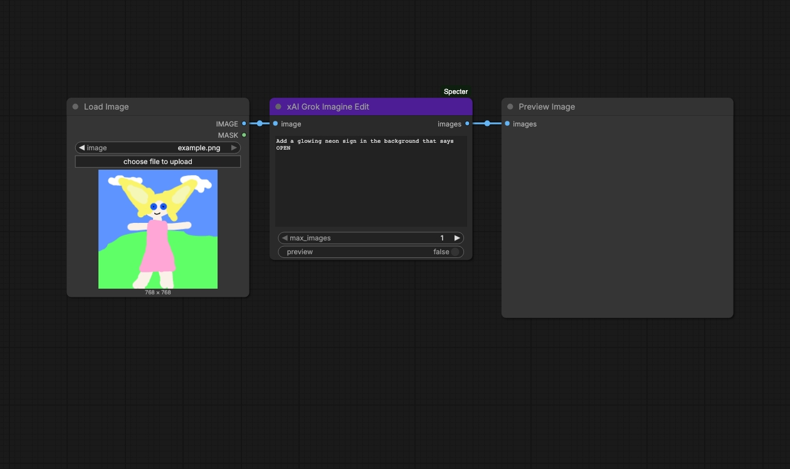
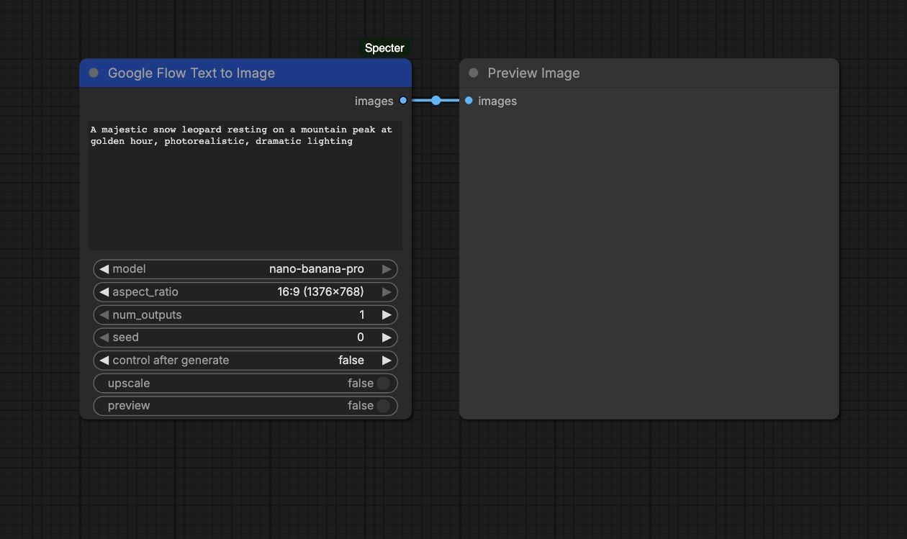
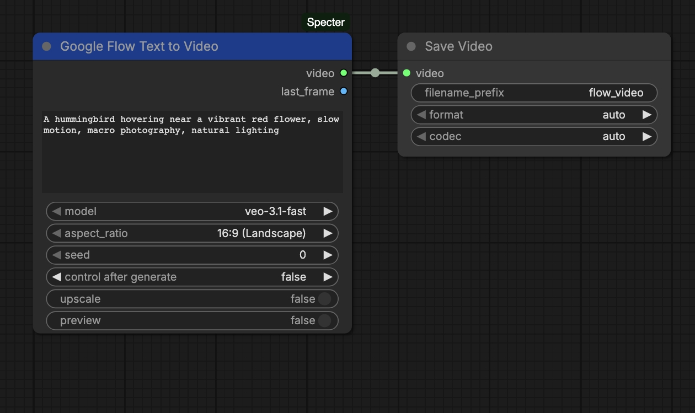
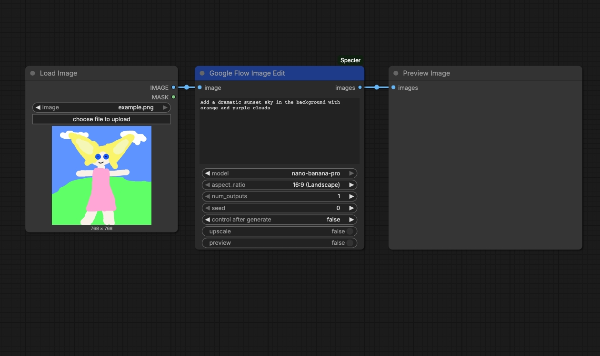
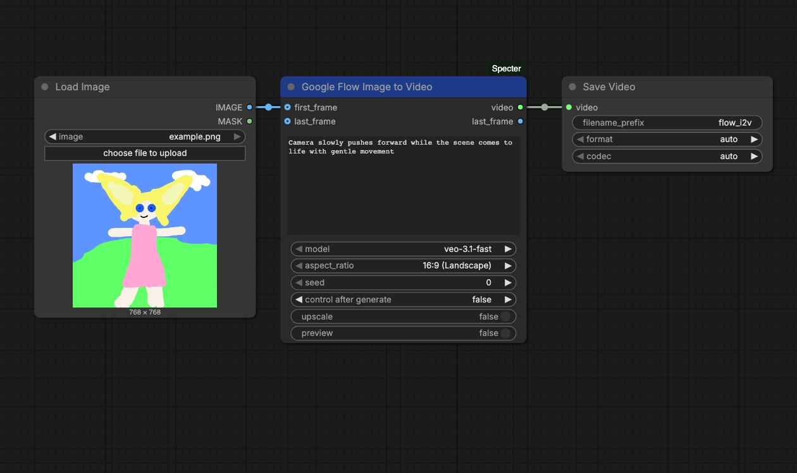
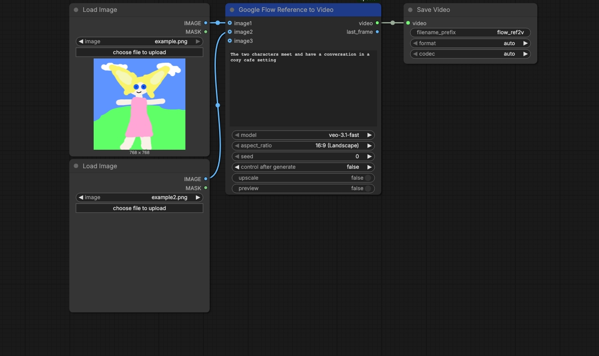

# ComfyUI-Specter

[](https://opensource.org/licenses/MIT)
[](https://github.com/comfyanonymous/ComfyUI)
[](https://www.python.org/)

**Use ChatGPT, Grok, Gemini, and Google Flow in ComfyUI.** No API keys, no extra costs. Just your existing accounts (even free tiers work).

*Specter is a stealthy browser phantom that automates web interfaces in the background. Headless and invisible.*




https://github.com/user-attachments/assets/ffbe5846-24ae-4c7c-a393-4b504e196287

## How It Works



## Why Specter?

Already paying for ChatGPT Plus/Pro, X Premium, or Google AI Pro/Ultra? Use those features in ComfyUI without extra API costs. All providers also offer free tiers that work with this extension.

| | API | Your Existing Subscription |
|---|---|---|
| **ChatGPT Image** | ~$0.05/image | Included |
| **GPT-5.2** | $0.88-7/1M tokens | Included |
| **Grok Image** | $0.01/image | Included |
| **Grok Video** | No API | Included |
| **Gemini** | $0.075-0.30/1M tokens | Included |
| **Google Flow Images** | No API | Free |
| **Google Flow Video** | No API | 50 credits free |

## Installation

### Windows

1. Clone to your ComfyUI `custom_nodes` folder:
   ```cmd
   cd ComfyUI\custom_nodes
   git clone https://github.com/lars-hagen/ComfyUI-Specter.git
   ```

2. Install dependencies:
   ```cmd
   cd ComfyUI-Specter
   pip install -r requirements.txt
   patchright install chrome
   ```

3. Restart ComfyUI

### macOS / Linux

1. Clone to your ComfyUI `custom_nodes` folder:
   ```bash
   cd ComfyUI/custom_nodes
   git clone https://github.com/lars-hagen/ComfyUI-Specter.git
   ```

2. Install dependencies:
   ```bash
   cd ComfyUI-Specter
   pip install -r requirements.txt
   patchright install chrome
   ```

3. Restart ComfyUI

### Authentication

After installation, authenticate with your accounts:

**Option 1: Embedded Browser (Recommended)**
- **Automatic:** Run any Specter node - a login popup appears if needed
- **Manual:** Go to Settings > Specter > Providers > Sign In

https://github.com/user-attachments/assets/81329d1c-42d0-48c0-9137-a19ed5b8ba41

**Option 2: Cookie Import**

If the embedded browser doesn't work (VPN, network restrictions, etc.), import cookies from your regular browser:

1. Install [Get cookies.txt LOCALLY](https://chromewebstore.google.com/detail/get-cookiestxt-locally/cclelndahbckbenkjhflpdbgdldlbecc) (Chrome/Edge) or [Firefox version](https://addons.mozilla.org/en-US/firefox/addon/get-cookies-txt-locally/)
2. Go to [chatgpt.com](https://chatgpt.com), [grok.com](https://grok.com), or [gemini.google.com](https://gemini.google.com) and log in
3. Click the extension icon and export cookies (JSON or Netscape TXT format)
4. In ComfyUI: Settings > Specter > Providers > click the import button > paste or drop the file

Sessions save automatically for future use.

## Nodes

### OpenAI (ChatGPT)

| Node | Description |
|------|-------------|
| **OpenAI ChatGPT** | Text chat with GPT models (supports image input) |
| **OpenAI GPT Image 1** | Image generation and editing with GPT Image 1.5 |

### xAI (Grok)

| Node | Description |
|------|-------------|
| **xAI Grok** | Text chat with Grok models (supports image input) |
| **xAI Grok Imagine** | Text-to-image generation |
| **xAI Grok Imagine Edit** | Image-to-image editing |
| **xAI Grok Imagine Video** | Text-to-video generation |
| **xAI Grok Imagine Video I2V** | Image-to-video generation |
| **xAI Grok Video Combine** | Combine two videos sequentially |

### Google (Gemini)

| Node | Description |
|------|-------------|
| **Google Gemini** | Multimodal chat (images, audio, video, files) |
| **Google Nano Banana** | Image generation with Gemini 1.5 Flash |
| **Google Nano Banana Pro** | Image generation with Gemini 3.0 models |

### Google Flow

| Node | Description |
|------|-------------|
| **Google Flow Text to Image** | Text-to-image with Imagen/Nano Banana models |
| **Google Flow Text to Video** | Text-to-video with Veo models (3.x has audio) |
| **Google Flow Image Edit** | Edit images with text instructions |
| **Google Flow Image to Video** | Animate with first/last frame control |
| **Google Flow Reference to Video** | Generate video from reference images |

### Tools

| Node | Description |
|------|-------------|
| **Specter Prompt Enhancer** | Enhance prompts using any chat model |
| **Google Prompt Enhancer** | Enhance prompts for Google's image models |
| **Specter Image Describer** | Generate descriptions from images |
| **Load Files** | Load files from disk for Gemini input |

## Example Workflows

### ChatGPT

#### ChatGPT Chat

[Download workflow](example_workflows/chatgpt_chat.json)

#### ChatGPT Text to Image

[Download workflow](example_workflows/chatgpt_txt2img.json)

#### ChatGPT Image to Image

[Download workflow](example_workflows/chatgpt_img2img.json)

#### ChatGPT Prompt Enhancer

[Download workflow](example_workflows/chatgpt_prompt_enhancer.json)

#### ChatGPT Image Describer

[Download workflow](example_workflows/chatgpt_image_describer.json)

### Grok

#### Grok Chat

[Download workflow](example_workflows/grok_chat.json)

#### Grok Text to Image

[Download workflow](example_workflows/grok_txt2img.json)

#### Grok Image Edit

[Download workflow](example_workflows/grok_img_edit.json)

#### Grok Text to Video

[Download workflow](example_workflows/grok_txt2vid.json)

#### Grok Image to Video

[Download workflow](example_workflows/grok_img2vid.json)

### Gemini

#### Gemini Chat

[Download workflow](example_workflows/gemini_chat.json)

#### Gemini Text to Image

[Download workflow](example_workflows/gemini_txt2img.json)

### Google Flow

#### Flow Text to Image

[Download workflow](example_workflows/flow_txt2img.json)

#### Flow Text to Video

[Download workflow](example_workflows/flow_txt2vid.json)

#### Flow Image Edit

[Download workflow](example_workflows/flow_img_edit.json)

#### Flow Image to Video

[Download workflow](example_workflows/flow_i2v.json)

#### Flow Reference to Video

[Download workflow](example_workflows/flow_ref2v.json)

## Rate Limits

| | Free | Paid | Top Tier |
|---|---|---|---|
| **ChatGPT Image** | ~3/day | ~50/3hr (Plus) | Unlimited (Pro) |
| **ChatGPT Text** | Limited | ~80/3hr (Plus) | Unlimited (Pro) |
| **Grok Image** | ~20/day | 100/day (Premium) | 200/day (SuperGrok) |
| **Grok Video** | ~20/day | 100/day (Premium) | 200/day (SuperGrok) |
| **Gemini** | 50/day | Higher (AI Pro) | Highest (AI Ultra) |
| **Google Flow Images** | Free (daily limit) | Free | Free |
| **Google Flow Video** | 50 credits/mo | 1,000/mo (AI Pro) | 25,000/mo (AI Ultra) |

## Troubleshooting

- **"Missing system dependencies"** - Run `patchright install chrome` to install the browser
- **Session expired?** Go to Settings > Specter > Providers and click Sign In
- **Browser not closing?** Check for zombie Chrome processes
- **Login loop?** Delete session via Settings > Specter or remove `user_data/` folder
